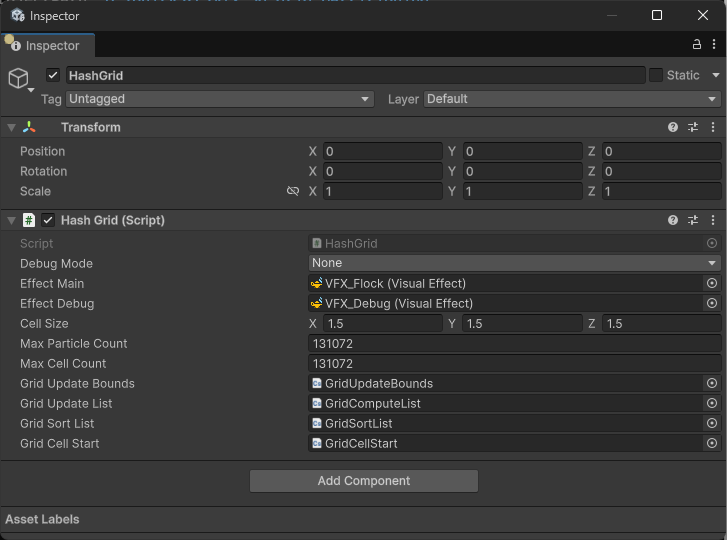
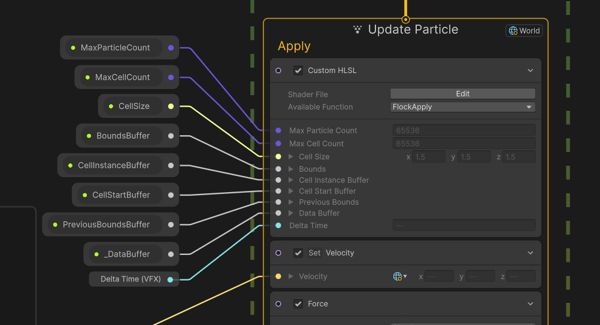
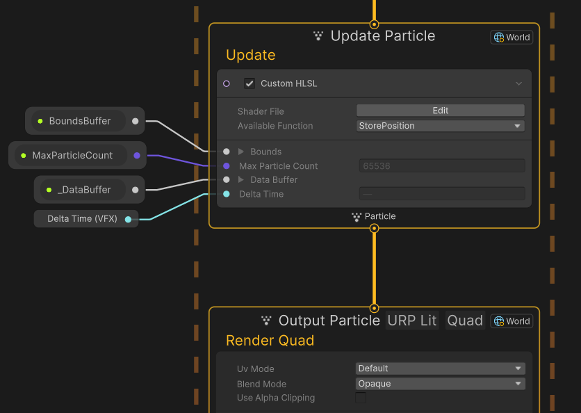

# 3D Flock Simulation with VFX Graph

Unity 6.x’s [Visual Effect Graph](https://unity.com/features/visual-effect-graph) currently lacks built-in spatial partitioning, but with [CustomHLSL](https://docs.unity3d.com/Packages/com.unity.visualeffectgraph@16.0/manual/Block-CustomHLSL.html), advanced integrations are now possible.

This sample demonstrates GPU-based flocking using a compute shader for spatial partitioning, inspired by [Particle Simulation using CUDA](https://developer.download.nvidia.com/assets/cuda/files/particles.pdf) (Simon Green). The compute shader is dispatched separately, with results fed back into the VFX Graph to update boid velocities.

While not the ultimate in performance or sophistication, this approach is efficient enough for real-time simulation on modern GPUs, and is flexible for other neighbor-based simulations.

---

## Quick Start

1. **Requirements**
   - [Unity 6000.1.11f1 (9b156bbbd4df)](https://unity.com/releases/editor/whats-new/6000.1.11) or newer.

2. **Getting Started**
   - Clone or download this repository.
   - Open the project with your compatible version of Unity.
   - Open either the `VFX_Flock` or `VFX_Plexus` scene from the `Scenes` folder.

---

## Scenes Overview

### VFX_Flock

**131,072 boids** simulated entirely on the GPU, with basic predator avoidance.

### VFX_Plexus

A minimal setup for debugging the spatial grid: each instance connects to its four nearest neighbors. This scene is easier to use for debugging than the flock system itself, making it ideal for inspecting and validating the grid logic.

---

## Setup

Both scenes use a `HashGrid` object to manage buffers and logic for spatial partitioning.

| Setting               | Purpose                                                                                                              |
|-----------------------|----------------------------------------------------------------------------------------------------------------------|
| **Debug Mode**        | - **None**: Standard mode. - **Profile**: Displays GPU timings for `HashGridUpdate` and `VFX.ParticleSystem.BatchUpdate`. - **Debug**: Visualizes grid occupancy (requires `VFX_Debug.fx`). |
| **Effect Main**       | The primary VisualEffect using the partitioning, typically `VFX_Flock.vfx`.                                          |
| **Effect Debug**      | Optional. Used to display debug overlay, typically `VFX_Debug.vfx`.                                                  |
| **Cell Size**         | Size of each partition cell.                                                                                         |
| **Max Particle Count**| Must be greater than or equal to, and ideally exactly equal to, the capacity of **Effect Main**.                     |
| **Max Cell Count**    | Amount of memory reserved for possible cell indices in the grid.                                                     |
| **Grid Update Bounds**| Shader to compute bounding box of all instances *(see Technical Overview)*.                                          |
| **Grid Update List**  | Shader to compute and store each particle’s `<CellId, ParticleId>` *(see Technical Overview)*.                       |
| **Grid Sort List**    | Shader to sort the `<CellId, ParticleId>` list by `CellId` *(see Technical Overview)*.                               |
| **Grid Cell Start**   | Shader to compute the start address for each cell in the buffer *(see Technical Overview)*.                          |

---

## Technical Overview

The `HashGrid` system reads the previous frame’s particle data to construct a data structure for neighbor queries. The algorithm follows [Simon Green’s CUDA approach](https://developer.download.nvidia.com/assets/cuda/files/particles.pdf):

1. **Compute Bounds**: Determine min/max positions from `_DataBuffer`, storing the result in `BoundsBuffer`. ([GridUpdateBounds.compute](Assets/Shaders/GridUpdateBounds.compute))
2. **Compute List:** For each particle position, compute `CellId` and store `<CellId, ParticleId>`. ([GridComputeList.compute](Assets/Shaders/GridComputeList.compute))
3. **Sort List**: Sort `CellInstanceBuffer` by `CellId`. ([GridSortList.compute](Assets/Shaders/GridSortList.compute))
4. **Compute Cell Start**: Store each cell’s start address for fast lookups. ([GridCellStart.compute](Assets/Shaders/GridCellStart.compute))

See [HashGrid.cs](Assets/Scripts/HashGrid.cs) for integration details.

### VFX Graph Integration

`VFX_Flock.vfx` uses two update contexts:

#### Apply

Custom HLSL updates particle velocities based on neighbor positions and velocities, iterating through relevant cells ([FlockCommon.hlsl](Assets/Shaders/FlockCommon.hlsl)). Additional logic for drag and predator avoidance is applied directly in the VFX Graph.

#### Update

After velocity updates, this pass compresses and stores particle data for the next frame’s grid update.

---

## Performance Improvement Candidates

This project is intended as a practical, adaptable reference, here are some areas for further optimization:

### Compression

- Positions and velocities are currently stored as 16-bit floats, halving bandwidth from 192 to 96 bits per particle. Further compression (e.g., packing velocity into 32 bits) is possible. (See `USE_COMPRESSED_DATA` usages in [GridCommon.hlsl](Assets/Shaders/GridCommon.hlsl))
- The `<CellId, ParticleId>` tuple is 64 bits, if IDs fit in 16 bits (less than 65536 values), this could be reduced to 32 bits. (See `CellInstanceBuffer` in [GridComputeList.compute](Assets/Shaders/GridComputeList.compute))

### Cache Locality

- `_DataBuffer` is currently indexed by `ParticleId`; reorganizing it by `CellId` after sorting could improve neighbor loop performance by reducing cache misses, though this would add complexity.
- The current memory layout for particle data employs an Array of Structures (AoS), where position and velocity components for a single particle are stored contiguously. This design choice is particularly beneficial for the `VFXUpdate` phase (identified as the current bottleneck), as it allows efficient, co-located access to a particle's full set of attributes. Conversely, this introduces a minor overhead for `Compute List` and `Compute Bounds` passes, which primarily require access to only a single attribute (such as position) across all particles. (See `USE_STRUCTURE_OF_ARRAYS` in [GridCommon.hlsl](Assets/Shaders/GridCommon.hlsl))
- `CellId` uses linear 3D indexing; other layouts may improve data locality. A Z-curve layout was considered, but it requires power-of-two bounds, which significantly increases the risk of `CellId` collisions. (See `CalculateHash` and usage of `USE_Z_CURVE` in [GridCommon.hlsl](Assets/Shaders/GridCommon.hlsl))
- Prefetching neighbor data during iteration through `CellInstanceBuffer` was explored, though the benefits remain unclear. (See `CELL_INSTANCE_BUFFER_PREFETCH` in [GridCommon.hlsl](Assets/Shaders/GridCommon.hlsl))

### Rendering Performance
In the flock sample, each boid is rendered as a simple lit URP quad. Even with this basic setup, vertex processing is a significant contributor to GPU time, and using more complex meshes would further increase this bottleneck. This currently limits scalability to several million instances.
For larger instance counts beyond what VFX Graph supports natively, alternative approaches like software rasterization or GPU ray tracing could be considered. These methods could leverage the established spatial partitioning to efficiently handle much higher numbers of boids, though they fall outside the scope of VFX Graph’s built-in rendering capabilities.

### Algorithmic Alternatives

- Hardcoding bounds to remove a dispatch (even though this isn’t a bottleneck), or using a pure hash function (not based on position, see `CalculateHash` in [GridCommon.hlsl](Assets/Shaders/GridCommon.hlsl)), could simplify and speed up cell addressing.
- Currently, the HashGrid Update is processed before the VFX dispatch. However, by using [async compute](https://docs.unity3d.com/6000.1/Documentation/ScriptReference/SystemInfo-supportsAsyncCompute.html), grid updates could run ahead of VFX, and neighbor logic could move to a standalone compute pass.
- For flocking, approximations (such as storing only per-cell averages or using adaptive resolution) may suffice for some applications. However, this project’s primary goal is to demonstrate a space partitioning approach that can be used for other algorithms; flocking is simply used here as an example.
- The GPU sorting solution used here is the same as the one VFX Graph uses internally (a combination of bitonic and merge sort) which works well for this scale of simulation. For even larger simulations, more advanced GPU sorting algorithms could offer better performance. For an overview of alternatives, see [GPUSorting](https://github.com/b0nes164/GPUSorting) by @b0nes164.
- Neighbor count storage, currently used for debug coloring, can be disabled if not needed. (See `USE_NEIGHBORCOUNT` in [GridCommon.hlsl](Assets/Shaders/GridCommon.hlsl))

---

## References

- [Boids Model](https://www.red3d.com/cwr/boids/) by Craig Reynolds
- [Particle Simulation using CUDA](https://developer.download.nvidia.com/assets/cuda/files/particles.pdf) by Simon Green
- [VFX Graph Sort.compute](https://github.com/Unity-Technologies/Graphics/blob/c8c6bff80f21d94e0640155ed869cb072f00e68d/Packages/com.unity.visualeffectgraph/Shaders/Sort.compute) - Unity VFXGraph package

---

## Additional

- [Coding Adventure: Simulating Fluids](https://www.youtube.com/watch?v=rSKMYc1CQHE) by @SebLague (based on Simon Green's reference)
- [A GPU Boids Simulator](https://axoloto.github.io/rtp/2021-07-11-boids/) by @axoloto (based on Simon Green's reference)
- [Former Simple 2D Grid approach](https://github.com/PaulDemeulenaere/vfx-neighborhood-grid)
- See forum post (soon)

Special thanks to @alelievr for profiling assistance, and to @julienf-unity and @OrsonFavrel for proofreading support.

*This project is compatible with Unity 6000.1.11f1 (9b156bbbd4df)*
